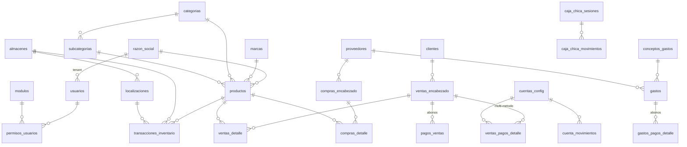

# EasyCount — Esquema de base de datos (Supabase / PostgreSQL)

Documentación de las tablas y vistas del proyecto. Los scripts de migración viven en [scripts/](../scripts/) y se ejecutan en orden en el SQL Editor de Supabase.

## Principio multi-tenant

Casi todas las tablas tienen la columna **`razon_social_id → razon_social.id`**: cada fila pertenece a una empresa. La app estampa este valor en cada insert ([lib/services/tenant-stamp.ts](../lib/services/tenant-stamp.ts)) y filtra todos los queries por él. La mayoría de tablas también guardan una columna `usuario` (text) con el nombre de quien creó el registro, a modo de auditoría ligera.

## Diagrama de relaciones (resumen)

---

## Núcleo: empresa, usuarios y permisos

### `razon_social`
Empresas (tenants) del sistema.

| Columna | Tipo | Notas |
|---|---|---|
| `id` | bigint | PK |
| `nombre_empresa` | text | NOT NULL — razón social legal |
| `nombre_comercial` | text | |
| `documento` | text | NOT NULL — RTN de la empresa |
| `correo`, `telefono`, `direccion` | text | |
| `logo_url` | text | Logo en Supabase Storage (aparece en facturas PDF) |

### `usuarios`
Perfil de aplicación ligado a Supabase Auth (el `id` es el uuid de `auth.users`).

| Columna | Tipo | Notas |
|---|---|---|
| `id` | uuid | PK = id en `auth.users` |
| `nombre` | text | NOT NULL |
| `rol` | text | default `'Usuario'` (ej. `Admin` / `Usuario`) |
| `activo` | boolean | default `true` — desactivar en vez de borrar |
| `razon_social_id` | bigint | FK → `razon_social.id` (empresa del usuario) |
| `created_at` | timestamptz | default `now()` |

### `modulos`
Catálogo de los 23 módulos de la app (espejo de [lib/constants/modulos.ts](../lib/constants/modulos.ts) — el `nombre` debe coincidir).

| Columna | Tipo | Notas |
|---|---|---|
| `id` | bigint | PK |
| `nombre` | text | NOT NULL — clave del permiso |
| `icono` | text | |

### `permisos_usuarios`
Qué módulo puede ver cada usuario (el `RouteGuard` bloquea la ruta si no hay permiso).

| Columna | Tipo | Notas |
|---|---|---|
| `id` | bigint | PK |
| `usuario_id` | uuid | FK → `usuarios.id` |
| `modulo_id` | bigint | FK → `modulos.id` |
| `puede_ver` | boolean | default `false` |

### `plataforma_admins` (script 037)
Allow-list de **super-admins de la plataforma** (el dueño de la app), un nivel por encima del `rol='Admin'` de cada empresa. Columnas: `user_id (uuid PK = auth.users.id), email, nombre, created_at`. RLS encendido **sin política para authenticated** → nadie la lee desde la app; el portal `/plataforma` la consulta con el service role (server-side). Acompañada de dos RPC `SECURITY DEFINER` con `EXECUTE` solo para `service_role`: `plataforma_resumen_empresas()` (métricas cross-tenant por empresa: usuarios, productos, ventas, ingreso, inventario, última venta y última conexión) y `plataforma_db_stats()` (tamaño de la BD y conexiones).

---

## Catálogos

### `productos`

| Columna | Tipo | Notas |
|---|---|---|
| `id` | bigint | PK |
| `nombre` | text | NOT NULL |
| `codigo_barras` | text | |
| `marca_id` | bigint | FK → `marcas.id` |
| `categoria_id` | bigint | FK → `categorias.id` |
| `subcategoria_id` | bigint | FK → `subcategorias.id` |
| `stock_total` | numeric | default 0 — cache del stock global (la verdad está en `transacciones_inventario`) |
| `costo_promedio` | numeric | default 0 — costo promedio ponderado, se recalcula en cada recepción de compra |
| `precio_venta_sugerido` | numeric | default 0 |
| `foto_url` | text | Supabase Storage |
| `razon_social_id` | bigint | FK tenant |
| `usuario`, `updated_at` | text, date | auditoría |

### `marcas`, `categorias`, `subcategorias`
Catálogos simples: `id` (PK), `nombre` (NOT NULL), `razon_social_id` (FK tenant), `usuario`, `created_at`. `subcategorias` además tiene `categoria_id` (FK → `categorias.id`) y `descripcion`.

### `clientes`

| Columna | Tipo | Notas |
|---|---|---|
| `id` | bigint | PK |
| `nombre` | text | NOT NULL |
| `rtn` | text | RTN para factura |
| `telefono`, `direccion` | text | |
| `fecha_nacimiento` | date | usado para alertas de cumpleaños |
| `limite_credito` | numeric | **(script 064, nullable)** tope de crédito acumulado (Lempiras). 0/NULL = sin límite. Si > 0, una venta a crédito que haga que el saldo pendiente total del cliente supere este monto se bloquea (Nueva Venta) u omite (carga masiva). |
| `razon_social_id` | bigint | FK tenant |

### `proveedores`
`id` (PK), `nombre` (NOT NULL), `rtn`, `contacto`, `razon_social_id`, `usuario`.

### `almacenes` y `localizaciones`
- `almacenes`: `id`, `nombre` (NOT NULL), `ubicacion`, `razon_social_id`, `usuario`.
- `localizaciones`: `id`, `nombre` (NOT NULL), `almacen_id` (FK → `almacenes.id`), `razon_social_id`, `usuario`. El stock se lleva a nivel almacén + localización.
- `localizaciones_config` (script 041): config por localización — `localizacion_id` (PK, FK → `localizaciones.id` ON DELETE CASCADE), `razon_social_id`, `es_punto_venta` (bool), `usuario`, `updated_at`, `created_at`. La localización con `es_punto_venta = true` (única por empresa: al marcar una se desmarcan las demás) se **preselecciona automáticamente** (almacén + localización) en Nueva Venta. RLS: el admin de la empresa lee y escribe sus propias filas (`razon_social_id = app_current_tenant()`), a diferencia de `razon_social_config` que solo escribe el portal.

---

## Ventas

### `ventas_encabezado`
Encabezado de factura de venta.

| Columna | Tipo | Notas |
|---|---|---|
| `id` | bigint | PK |
| `numero_factura` | text | correlativo INTERNO generado por la app (`FC-####`, serie global atómica, script 052). Alimenta caja, cierre, historial. |
| `numero_fiscal` | text | **(script 062, nullable)** correlativo FISCAL CAI `ESTAB-PUNTO-TIPO-NNNNNNNN` (p.ej. `000-001-01-00000003`), solo si la empresa tiene Facturación CAI activa. Se emite atómico (`siguiente_correlativo_cai`, script 061) al crear la venta. NULL en ventas sin CAI. |
| `cai_emitido` | text | **(script 062, nullable)** snapshot del CAI vigente al emitir la factura. |
| `tipo_documento_fiscal` | text | **(script 062, nullable)** tipo SAR emitido: `01` Factura, `06` Nota Crédito, `07` Nota Débito. |
| `cliente_id` | bigint | FK → `clientes.id` |
| `almacen_id` | bigint | FK → `almacenes.id` — almacén del que sale la mercancía |
| `fecha_venta` | timestamptz | default `now()` |
| `tipo_pago` | text | Contado / Parcial / Crédito |
| `aplica_impuesto` | boolean | |
| `porcentaje_impuesto` | numeric | default 15 (ISV Honduras) |
| `descuento` | numeric | % de descuento sobre el subtotal |
| `subtotal` | numeric | default 0 — bruto antes de descuento |
| `impuesto_total` | numeric | default 0 — sobre (subtotal − descuento) |
| `total_venta` | numeric | default 0 — **BRUTO** (subtotal − descuento + ISV): lo que factura/paga el cliente. La comisión bancaria NO lo reduce (es un costo aparte). Coincide con la suma de las líneas de `ventas_detalle`. Ver script 027. |
| `valorpago` | numeric | default 0 — pagado acumulado en **bruto** (`Σ monto_bruto`); `saldo = total_venta − valorpago` |
| `estado_pago` | text | `Pendiente` / `Parcial` / `Pagado` |
| `razon_social_id` | bigint | FK tenant |
| `usuario` | text | vendedor |

### `ventas_detalle`
Líneas de la venta. Congela el costo al momento de vender (para el CMV del estado de resultados).

| Columna | Tipo | Notas |
|---|---|---|
| `id` | bigint | PK |
| `venta_id` | bigint | FK → `ventas_encabezado.id` |
| `producto_id` | bigint | FK → `productos.id` |
| `cantidad` | numeric | |
| `precio_unitario` | numeric | |
| `costo_promedio_momento` | numeric | snapshot del costo promedio al vender |
| `utilidad_linea` | numeric | (precio − costo) × cantidad |
| `razon_social_id` | bigint | FK tenant |

### `ventas_pagos_detalle`
Desglose multi-método del pago de una venta (ej. 500 efectivo + 1000 tarjeta). Alimenta caja chica, cuentas bancarias y el cierre diario.

| Columna | Tipo | Notas |
|---|---|---|
| `id` | serial | PK |
| `venta_id` | integer | FK → `ventas_encabezado.id` ON DELETE CASCADE |
| `metodo_pago` | text | CHECK: `Efectivo` / `Banco` / `Link_Pago` / `Credito` / `Otro` |
| `cuenta_id` | integer | FK → `cuentas_config.id` (solo Banco / Link_Pago) |
| `monto_bruto` | numeric(14,2) | lo que paga el cliente (≥ 0) |
| `porcentaje_comision` | numeric(5,2) | snapshot de la comisión de la cuenta al momento de la venta |
| `monto_neto` | numeric(14,2) | bruto × (1 − comisión/100) — lo que entra al banco |
| `razon_social_id` | integer | FK tenant |
| `fecha`, `monto_recibido`, `comision_monto` | | columnas usadas por la vista de cierre diario |

### `pagos_ventas`
Abonos posteriores a ventas al crédito (cuentas por cobrar).

| Columna | Tipo | Notas |
|---|---|---|
| `id` | bigint | PK |
| `venta_id` | bigint | FK → `ventas_encabezado.id` |
| `fecha_pago` | timestamptz | default `now()` |
| `monto` | numeric | incrementa `ventas_encabezado.valorpago` |
| `metodo_pago` | text | |
| `razon_social_id` | smallint | FK tenant |

---

## Compras

### `compras_encabezado`
Órdenes de compra, con soporte de importación (moneda extranjera + costos adicionales).

| Columna | Tipo | Notas |
|---|---|---|
| `id` | bigint | PK |
| `proveedor_id` | bigint | FK → `proveedores.id` |
| `numero_factura` | text | **(script 065, nullable)** número de la factura del proveedor (Recepción por Factura). |
| `fecha_orden` | timestamptz | default `now()` |
| `fecha_tentativa` | date | fecha estimada de llegada |
| `moneda` | text | `LPS` / `USD` |
| `tasa_cambio` | numeric | default 1 |
| `costos_importacion`, `impuestos_compra`, `otros_costos` | numeric | se prorratean al costo final |
| `total_compra_local` | numeric | total en moneda local |
| `estado` | text | `Pendiente` / `Recibida` / `Cancelada` |
| `razon_social_id` | bigint | FK tenant |

### `compras_detalle`

| Columna | Tipo | Notas |
|---|---|---|
| `id` | bigint | PK |
| `compra_id` | bigint | FK → `compras_encabezado.id` |
| `producto_id` | bigint | FK → `productos.id` |
| `cantidad` | numeric | cantidad ordenada |
| `cantidad_recibida` | numeric | default 0 — se llena en la recepción (permite recepciones parciales) |
| `costo_unitario_moneda_origen` | numeric | costo en LPS o USD |
| `costo_final_local` | numeric | default 0 — costo unitario en LPS incluyendo prorrateo de importación; con este valor se recalcula el costo promedio del producto |
| `razon_social_id` | bigint | FK tenant |

---

## Inventario

### `transacciones_inventario`
**Kardex / libro mayor del inventario.** El stock nunca se edita directo: es la suma de las cantidades (positivas = entrada, negativas = salida).

| Columna | Tipo | Notas |
|---|---|---|
| `id` | bigint | PK |
| `producto_id` | bigint | FK → `productos.id` |
| `almacen_id` | bigint | FK → `almacenes.id` |
| `localizacion_id` | bigint | FK → `localizaciones.id` |
| `tipo_movimiento` | text | `Entrada Compra` / `Salida Venta` / `Traslado Entrada` / `Traslado Salida` / `Ajuste` |
| `cantidad` | numeric | positiva o negativa |
| `costo_o_precio_unitario` | numeric | costo (entradas) o precio (salidas) |
| `referencia_id` | bigint | id del documento origen (compra, venta, traslado) |
| `fecha` | timestamptz | default `now()` |
| `razon_social_id` | bigint | FK tenant |

---

## Finanzas

### `cuentas_config`
Cuentas de tesorería (bancos, POS, links de pago) con su comisión.

| Columna | Tipo | Notas |
|---|---|---|
| `id` | serial | PK |
| `nombre` | text | NOT NULL (ej. "BAC Crédito") |
| `tipo` | text | default `'Banco'` |
| `saldo` | numeric | default 0 — saldo corriente de la cuenta |
| `comision_porcentaje` | numeric | default 0 — % que cobra el banco/pasarela |
| `activo` | boolean | default `true` |
| `razon_social_id` | bigint | FK tenant |

### `cuenta_movimientos`
Movimientos de cada cuenta bancaria (depósitos por ventas, transferencias desde caja, pagos de gastos). Definida en [scripts/011-tesoreria-caja-chica.sql](../scripts/011-tesoreria-caja-chica.sql): `cuenta_id` (FK → `cuentas_config`), `tipo`, `monto`, `concepto`, `ref_tipo`/`ref_id` (trazabilidad), `saldo_resultante`, `usuario`, `razon_social_id`.

> **Integridad de tesorería (script 039).** Los movimientos de caja/banco de una venta/gasto/devolución llevan `ref_tipo` + `ref_id` al padre. Triggers `AFTER DELETE` (función `tg_limpiar_tesoreria_ref`) en `gastos`, `ventas_encabezado` y `devoluciones_encabezado` borran esos movimientos automáticamente al eliminar el padre y recalculan la cadena `saldo_resultante` + el cache `cuentas_config.saldo`, para que **nunca** quede tesorería huérfana. **El saldo de caja chica se calcula como SUMA de `monto`** (con signo) en la app (`getSaldoActual`), no desde el último `saldo_resultante`: así es inmune a movimientos borrados. La Consolidación Bancaria también suma los movimientos crudos.

> **Backstop de hora de Honduras (script 040).** Toda fecha de transacción se guarda en HN codificada como UTC (`getHondurasNowISO` = `now()-6h`, HN es UTC-6 sin DST) y se muestra con `.split('T')[0]` / `timeZone:'UTC'`. Como respaldo, triggers `BEFORE INSERT` (funciones `tg_forzar_fecha_hn` / `tg_forzar_fecha_pago_hn`) en `transacciones_inventario`, `cuenta_movimientos`, `caja_chica_movimientos`, `pagos_ventas` y `devoluciones_encabezado` **fuerzan** la `fecha`/`fecha_pago` a HN si llega NULL (tomaría el DEFAULT `now()` = UTC real) o "en UTC real" (a menos de 3h de `now()`, típico de un cliente con la app cacheada vieja). Una fecha HN correcta (~6h antes de `now()`) no se toca. `ventas_encabezado.fecha_venta` y `gastos.fecha_gasto` quedan fuera (el usuario puede elegir su fecha).

### `caja_chica_sesiones`
Sesiones de caja (apertura → movimientos → cierre). **Solo puede haber una sesión `Abierta` por empresa** (índice único parcial `uq_caja_sesion_abierta_por_razon`).

| Columna | Tipo | Notas |
|---|---|---|
| `id` | serial | PK |
| `razon_social_id` | integer | FK tenant, NOT NULL |
| `fecha` | date | día operativo de la sesión |
| `created_at` | timestamptz | timestamp de apertura. La app expone `fecha_apertura` como **alias de `created_at`**. **No hay columnas `fecha_apertura` ni `fecha_cierre`**: la hora de cierre se deriva del movimiento sintético `Cierre`. |
| `saldo_inicial` | numeric(14,2) | monto de apertura |
| `saldo_final_real` | numeric(14,2) | lo contado físicamente al cerrar |
| `saldo_final_calculado` | numeric(14,2) | saldo según movimientos |
| `diferencia` | numeric(14,2) | real − calculado (faltante/sobrante) |
| `estado` | text | CHECK: `Abierta` / `Cerrada` |
| `usuario_apertura`, `usuario_cierre` | text | |

### `caja_chica_movimientos`
Movimientos de la sesión con saldo corriente.

| Columna | Tipo | Notas |
|---|---|---|
| `id` | serial | PK |
| `sesion_id` | integer | FK → `caja_chica_sesiones.id` ON DELETE CASCADE |
| `tipo` | text | CHECK: `Apertura` / `Ingreso_Manual` / `Ingreso_Venta` / `Salida` / `Transferencia_Banco` / `Cierre` |
| `monto` | numeric(14,2) | positivo = entrada, negativo = salida |
| `concepto` | text | |
| `ref_tipo`, `ref_id` | text, integer | trazabilidad (ej. venta que generó el ingreso) |
| `cuenta_destino_id` | integer | FK → `cuentas_config.id` — solo para `Transferencia_Banco` |
| `saldo_resultante` | numeric(14,2) | saldo de caja después del movimiento |
| `fecha` | timestamptz | fecha operativa del movimiento (default `now()`). **Agregada por el script 034** en bases que se crearon sin ella; el Flujo de Caja filtra/agrupa por esta columna. |
| `razon_social_id` | integer | FK tenant |

### `conceptos_gastos`
Catálogo de conceptos con categoría macro para el estado de resultados.

| Columna | Tipo | Notas |
|---|---|---|
| `id` | bigint | PK |
| `nombre` | text | NOT NULL |
| `categoria_macro` | text | NOT NULL — `Servicios` / `Publicidad` / `Nomina` / `Arriendo` / otros |
| `razon_social_id` | bigint | FK tenant |

### `gastos`
Gastos y facturas de proveedor (cuentas por pagar).

| Columna | Tipo | Notas |
|---|---|---|
| `id` | bigint | PK |
| `concepto_id` | bigint | FK → `conceptos_gastos.id` |
| `proveedor_id` | bigint | FK → `proveedores.id` |
| `descripcion` | text | |
| `monto` | numeric | NOT NULL — total del gasto/factura |
| `monto_pagado` | numeric | default 0 — suma de abonos |
| `estado_pago` | text | default `'Pendiente'` (`Pendiente` / `Parcial` / `Pagado`) |
| `metodo_pago` | text | |
| `fecha_gasto` | date | default `CURRENT_DATE` |
| `fecha_vencimiento` | date | para cuentas por pagar |
| `comprobante_url` | text | imagen del comprobante en Storage |
| `razon_social_id` | bigint | FK tenant |

### `gastos_pagos_detalle`
Historial de abonos a cada gasto/factura. La suma actualiza `gastos.monto_pagado` y `estado_pago` (lógica en el servicio).

| Columna | Tipo | Notas |
|---|---|---|
| `id` | serial | PK |
| `gasto_id` | integer | FK → `gastos.id` ON DELETE CASCADE |
| `fecha_pago` | timestamptz | default `now()` |
| `monto` | numeric(14,2) | CHECK > 0 |
| `metodo_pago` | text | CHECK: `Efectivo` / `Banco` / `Otro` |
| `cuenta_id` | integer | FK → `cuentas_config.id` |
| `caja_movimiento_id`, `cuenta_movimiento_id` | integer | trazabilidad cruzada con caja chica / bancos |
| `razon_social_id` | integer | FK tenant |

### `consolidacion_saldos_iniciales` (script 035)
Override manual del **saldo de inicio del mes** por cuenta bancaria, para el módulo Consolidación Bancaria. La consolidación diaria se **calcula** desde `cuenta_movimientos` (no se persiste); aquí solo se guarda el saldo inicial que el admin fija a mano cuando el calculado no arranca donde debe. Columnas: `id, razon_social_id, cuenta_id (FK cuentas_config), anio, mes (CHECK 1–12), saldo_inicial, usuario, created_at, updated_at`, con `UNIQUE (razon_social_id, cuenta_id, anio, mes)`. RLS de aislamiento por tenant.

---

## Devoluciones (script 020)

### `devoluciones_encabezado`
Nota de crédito por devolución (la factura original queda intacta): `id, razon_social_id, venta_id (FK ventas_encabezado), numero_devolucion (DEV-####), fecha, motivo, monto_total, destino_reembolso ('caja'|'cuenta'), cuenta_id (FK cuentas_config, nullable), usuario, created_at`.

### `devoluciones_detalle`
Líneas devueltas: `id, razon_social_id, devolucion_id (FK cascade), venta_detalle_id (FK), producto_id (FK), cantidad_devuelta (>0), precio_unitario, costo_promedio_momento, subtotal`.

---

## Pedidos por Catálogo (script 021)

### `catalogo_links`
Links públicos tokenizados: `id, razon_social_id, token (UNIQUE), nombre (referencia interna), tipo ('completo'|'seleccion'), estado ('Activo'|'Usado'|'Vencido'|'Anulado'), fecha_expiracion, usuario, created_at`. El lado público NO consulta la tabla directo: entra por endpoints server-side (service role) donde el token es la autorización.

### `catalogo_link_productos`
Productos incluidos cuando el link es tipo `seleccion`: `id, razon_social_id, link_id (FK cascade), producto_id (FK)`.

### `pedidos_encabezado`
Pedido enviado por el cliente desde el link: `id, razon_social_id, link_id (FK), numero_pedido (PED-####), cliente_nombre, cliente_telefono, notas, total, estado ('Pendiente'|'Aprobado'|'Rechazado'), motivo_rechazo, venta_id (FK ventas_encabezado, se llena al aprobar), usuario (admin que resolvió), created_at`.

### `pedidos_detalle`
Líneas del pedido: `id, razon_social_id, pedido_id (FK cascade), producto_id (FK), cantidad (>0), precio_unitario` (recalculado server-side desde el catálogo, editable por el admin en la revisión), `subtotal`.

---

## Ajustes de Inventario (script 023)

### `ajustes_inventario`
Bitácora de ajustes por conteo físico (una fila por línea ajustada, no cabecera+detalle). El movimiento real vive en `transacciones_inventario` como `tipo_movimiento = 'Ajuste'`; esta tabla guarda el contexto de auditoría porque `transacciones_inventario` no tiene columna de motivo: `id, razon_social_id, producto_id (FK), almacen_id (FK), localizacion_id (FK), stock_anterior, stock_real, delta (= real − anterior; + entrada / − salida), costo_unitario (costo promedio congelado, informativo), motivo, usuario, created_at`. El ajuste **no altera** `productos.costo_promedio`.

---

## Ediciones de ventas (script 024)

### `ventas_ediciones`
Bitácora de auditoría de la función "Editar venta" del Historial. La edición reversa-y-recrea los efectos de la venta (inventario, caja, bancos, CxC) **en su lugar** (mismo `venta_id` y número de factura). Columnas: `id, razon_social_id, venta_id (FK), numero_factura, usuario, motivo, antes JSONB, despues JSONB, created_at`. Best-effort: si la tabla no existe, la edición igual se aplica (solo no queda el historial). RLS de aislamiento por tenant.

---

## Ajuste de Costo (script 026)

### `ajustes_costo`
Bitácora del módulo Ajuste de Costo (una fila por operación). Registra el cambio manual de `productos.costo_promedio` y, si aplica, el recálculo retroactivo del costo congelado de las ventas de un producto en un intervalo: `id, razon_social_id, producto_id (FK), costo_anterior, costo_nuevo, stock_al_momento, valor_inv_anterior, valor_inv_nuevo, recalculo_ventas (bool), rango_desde (date), rango_hasta (date), ventas_afectadas, cmv_anterior, cmv_nuevo, motivo, usuario, created_at`. Best-effort: si la tabla no existe, el ajuste igual se aplica (solo no queda bitácora). RLS por tenant.

### Funciones (RPC)
- **`fijar_costo_promedio(p_producto_id, p_costo)`** → `numeric`: SET absoluto de `productos.costo_promedio` (override manual, no promedio ponderado). SECURITY INVOKER (respeta la RLS de `productos`). La app la usa vía `fijarCostoPromedio` en `lib/services/stock.ts`, con fallback JS si no existe.
- **`recalcular_costo_ventas(p_producto_id, p_costo, p_desde, p_hasta)`** → `integer` (nº de líneas de venta afectadas): reescribe, **de forma transaccional (todo-o-nada)**, el costo PLANO en las ventas del rango — `ventas_detalle.costo_promedio_momento` + `utilidad_linea = (precio_unitario − costo) × cantidad`, `transacciones_inventario.costo_o_precio_unitario` de las `'Salida Venta'` de esas ventas, y `devoluciones_detalle.costo_promedio_momento` de las devoluciones del período. Resuelve los `venta_id` desde `ventas_encabezado.fecha_venta`. SECURITY INVOKER. Límite: aplica un costo uniforme al intervalo (borra variaciones legítimas de costo del período).

---

## Plataforma y personalización por empresa

### `plataforma_admins` (script 037)
Allow-list de super-admins del dueño de la app (cuentas SIN empresa que ven el portal `/plataforma`): `user_id (uuid, PK, FK auth.users), email, nombre, created_at`. **RLS bloqueada para `authenticated`** (sin política de lectura): solo el `service_role` la consulta, vía las RPC del portal. RPCs asociadas (SECURITY DEFINER, `GRANT EXECUTE` solo a `service_role`): `plataforma_resumen_empresas()` (métricas por empresa) y `plataforma_db_stats()` (tamaño BD, conexiones).

### `razon_social_config` (script 038)
Feature flags / mini-personalizaciones por empresa: `razon_social_id (INTEGER, PK, FK razon_social ON DELETE CASCADE), config (JSONB, default '{}'), usuario, updated_at, created_at`. Un solo código para todas; el comportamiento por empresa lo gobiernan DATOS (este JSON), no forks. Defaults tipados en `lib/constants/feature-flags.ts` (`mergeFlags` combina la config guardada con ellos). **RLS**: cada empresa LEE solo su fila (`razon_social_id = app_current_tenant()`); **no hay política de escritura para `authenticated`** → solo el `service_role` (portal de super-admin, `setEmpresaFlag`) escribe, así los flags los administra el dueño de la app y no cada empresa. Flags actuales: `ventas_mostrar_isv` (si es `false`, la empresa vende sin ISV: se oculta el toggle y la fila de ISV en Nueva Venta y se fuerza `impuesto_total = 0`); `facturacion_cai` (habilita el módulo "Facturación CAI" para emitir comprobantes fiscales del SAR).

### `facturacion_cai_config` (script 060)
Configuración fiscal por empresa para emitir facturas oficiales del SAR (Honduras). **Una fila por (`razon_social_id`, `tipo_documento`)** — `UNIQUE (razon_social_id, tipo_documento)` — porque el SAR autoriza rangos por punto de emisión y tipo (`01` Factura, `06` Nota de Crédito, `07` Nota de Débito). Columnas: `id (PK), razon_social_id, tipo_documento, cai, establecimiento, punto_emision, rango_inicial, rango_final, correlativo_actual, fecha_limite_emision (date), imprenta_nombre, imprenta_rtn, imprenta_registro, activo, usuario, created_at, updated_at`. El correlativo visible se arma como `ESTAB-PUNTO-TIPO-NNNNNNNN` (p.ej. `000-001-01-00000003`); el formateo lo hace la app (`formatearCorrelativoCai`, `lib/services/facturacion-cai.ts`). El encabezado (nombre, RTN, dirección, teléfono) se reutiliza de `razon_social`, no se duplica aquí. **RLS** por tenant (`razon_social_id = app_current_tenant()`, lectura y escritura): a diferencia de los flags, esta config la edita el **admin de la empresa** (el CAI lo gestiona el contribuyente). El módulo `Facturación CAI` nace deshabilitado y se muestra solo si el flag `facturacion_cai` está activo. Fase 1: solo captura los datos; los imprimibles se enganchan en la Fase 2.

---

## Vistas

### `vista_stock_por_localizacion`
Stock actual por producto/almacén/localización: `SUM(cantidad)` de `transacciones_inventario` agrupado por `producto_id, almacen_id, localizacion_id`.

### `vista_cierre_diario`
Resumen por día y empresa (FULL JOIN de ventas + sesiones de caja + pagos): `total_ventas`, `cantidad_ventas`, `caja_chica_inicial/final`, `estado_caja`, `cobrado_efectivo`, `cobrado_bancos`, `comisiones_bancarias`.

### `vista_historico_caja_chica`
Cada sesión de caja con sus totales: `saldo_inicial`, `total_ingresos` (Apertura + Ingresos), `total_egresos` (Salidas + Transferencias + Cierre), `saldo_final_real`, `saldo_final_calculado`, `diferencia`, `estado`.

### `vista_cuentas_por_pagar`
Gastos con `estado_pago <> 'Pagado'` join proveedor: `monto_total`, `monto_pagado`, `saldo_pendiente`, `fecha_vencimiento`.

### `vista_estado_resultados_mensual`
P&L por mes: `ventas`, `cmv` (Σ `costo_promedio_momento × cantidad` de `ventas_detalle`), `utilidad_bruta`, gastos por categoría macro (`gastos_servicios`, `gastos_publicidad`, `gastos_nomina`, `gastos_arriendo`, `gastos_otros`), `total_gastos`, `utilidad_neta` y `porcentaje_margen_neta`.

### `vista_stock_producto_almacen` / `vista_ultima_venta_producto` (script 067)
Agregación para la Valoración de Inventario, `security_invoker` (respetan la RLS de `transacciones_inventario`). La primera: `SUM(cantidad)` por `(razon_social_id, producto_id, almacen_id)` = stock por almacén. La segunda: `MAX(fecha)` de los movimientos `'Salida Venta'` por `(razon_social_id, producto_id)` = última venta. `getValoracionInventarioExtendida` las lee para no traer todo el kardex y agregar en JS; si no existen, cae al cálculo en JS (fallback).

---

## Officemart — base común (script officemart-001)

Objetos propios del esquema `officemart` (no existen en EasyCount/`public`).

### `auditoria`
Bitácora genérica de acciones de negocio: `id, razon_social_id, entidad` (`'venta'|'recibo'|'devolucion'|'compra'|'orden'|...`), `entidad_id, accion` (`'crear'|'anular'|'editar'|'pagar'|...`), `motivo, antes (jsonb), despues (jsonb), usuario, created_at`. RLS por tenant **solo SELECT e INSERT**: la app nunca edita ni borra la bitácora. La escribe `registrarAuditoria` (`lib/services/auditoria.ts`) en modo best-effort (si falla, la operación de negocio no se revierte).

### `correlativos`
Numeración atómica por empresa y serie: `razon_social_id, serie` (PK compuesta; `'DEV'`, `'PED'`, `'RC'`, `'COT'`, `'OT'`, `'venta:<punto>'`…), `ultimo_numero, updated_at`. RLS por tenant.
- **`siguiente_correlativo(p_serie, p_prefijo='', p_pad=4, p_razon_social_id=NULL)`** → `text` (p.ej. `RC-0007`): `INSERT … ON CONFLICT DO UPDATE … RETURNING` = lock de fila, dos usuarios simultáneos nunca reciben el mismo número. SECURITY INVOKER (la RLS impide emitir para otra empresa); `p_razon_social_id` solo lo usa el service role en rutas públicas (pedido por catálogo). La app la llama vía `emitirCorrelativo` (`lib/services/correlativos.ts`); si el RPC no existe, cada llamador cae a su `COUNT(*)+1` anterior.
- **`peek_correlativo(...)`** → el número que saldría a continuación (solo lectura).

### Columnas nuevas en tablas existentes (nullable, sin default)
- `cuenta_movimientos.referencia` (nº de transferencia/cheque, para el pareo bancario), `conciliado_at` (fecha en que la conciliación lo pareó con el extracto), `extracto_linea_id` (línea del extracto). Índice `(cuenta_id, fecha, id)`.
- `transacciones_inventario.referencia_tipo` (`'venta'|'anulacion_venta'|'devolucion'|'recepcion'|'orden_produccion'|…`): dice a qué documento apunta `referencia_id`. Las filas anteriores quedan NULL y la app sigue infiriendo por `tipo_movimiento`.

> **Cadena de saldos por (fecha, id).** `registrarMovimientoCuenta` acepta `fecha` (pasada, nunca futura ni dentro de un período conciliado) y `referencia`. Por eso `recalcCadenaSaldoCuenta` y el trigger `tg_limpiar_tesoreria_ref` (reemplazado por este script, mismo OID) acumulan `saldo_resultante` en orden cronológico `(fecha, id)` y no por orden de inserción; las lecturas de movimientos ordenan `fecha desc, id desc`.

## Officemart — cimientos de catálogos (script officemart-002)

### `lineas`
Línea de producto: clasificación transversal e independiente de la categoría (`id, razon_social_id, nombre, descripcion, activo, usuario, created_at, updated_at`; único `(razon_social_id, lower(nombre))`; RLS por tenant). `productos.linea_id` (bigint nullable, **sin FK**: PostgREST no puede embeber `lineas(nombre)`, el nombre lo resuelve `getLineasProducto` en la app). Una línea con productos no se borra: se desactiva.

### `zonas` y `vendedores`
- `zonas`: `id, razon_social_id, nombre, ciudad, activo, ...` (único por nombre y tenant). Se asigna en `clientes.zona_id`.
- `vendedores`: `id, razon_social_id, nombre, usuario_id (uuid = auth.users.id, opcional), correo, telefono, activo, ...`. Se asigna en `clientes.vendedor_id` (vendedor de cartera) y se guarda en cada venta en `ventas_encabezado.vendedor_id` (índice `(razon_social_id, vendedor_id)`), base de comisiones y reportes por vendedor. Un vendedor con ventas no se borra: se desactiva. Módulo `Vendedores y Zonas` (opt-in); flag `ventas_vendedor_obligatorio`.

### Columnas nuevas (nullable, sin default)
- `clientes`: `notas` (se muestra al elegir el cliente en Nueva Venta), `correo`, `dias_credito` (plazo de sus facturas; con facturas vencidas más allá del plazo, Nueva Venta bloquea el crédito — `bloqueoCreditoCliente` / `getFacturasVencidasCliente` en `lib/services/ventas.ts`), `cliente_relacionado_id` ("segundo cliente"), `bloqueado` + `motivo_bloqueo` (bloqueo manual de crédito), `zona_id`, `vendedor_id`.
- `proveedores`: `correo, telefono, direccion, notas, moneda ('LPS'|'USD'), pais, dias_credito`. `rtn` pasa a ser opcional en la app (proveedor extranjero). Las dos interfaces `Proveedor` (`catalogos.ts` y `proveedores.ts`) quedaron unificadas en la de `catalogos.ts`.

## Officemart — anulación, reclamos y recibos (script officemart-003)

### Anulación de ventas ("compensar, no borrar")
`ventas_encabezado` gana `anulada_at timestamptz` (NULL = vigente), `anulada_por`, `motivo_anulacion`, `anulacion_tipo` (`'Anulacion'|'Reclamo'`), `reclamo_id`. `anularVenta` (`lib/services/ventas.ts`) marca la fila (UPDATE idempotente `WHERE anulada_at IS NULL`) y registra **contra-asientos**: `ajustarStock(+cantidad)` + kardex `'Entrada Anulacion'` (`referencia_id` = venta, `referencia_tipo='anulacion_venta'`) y, si había dinero cobrado, `Salida` de caja o `Egreso` de cuenta con `ref_tipo='anulacion_venta'`. No toca detalle, pagos ni `valorpago`: la factura queda como foto histórica. Toda consulta que agrega ventas usa el filtro `anulada_at IS NULL` vía `ejecutarVigentes` (`lib/services/ventas-filtros.ts`, con reintento sin filtro si la columna no existe). `plataforma_resumen_empresas` se recreó con el mismo filtro. Las vistas `vista_cierre_diario` y `vista_estado_resultados_mensual` **no** se tocan (la clonada tiene más columnas que el script 013 y `CREATE OR REPLACE VIEW` no puede quitar columnas): el cierre diario y el P&L se calculan siempre desde las tablas en la app y ya no leen esas vistas. El borrado físico (`eliminarVentaCompletamente`) y la edición quedan bloqueados si la venta está anulada, tiene abonos por recibo o asientos conciliados; el flag `ventas_permitir_eliminar` (default false) oculta "Eliminar" en el Historial.

### `ventas_reclamos`
`id, razon_social_id, venta_id, cliente_id, tipo ('Producto'|'Precio'|'Entrega'|'Otro'), descripcion, estado ('Abierto'|'Resuelto'|'Rechazado'), resolucion, resultado ('Anulacion'|'Devolucion'|'Sin cambio'), devolucion_id, resuelto_at, resuelto_por, usuario, created_at, updated_at`. RLS por tenant. Módulo "Reclamos de Ventas".

### `recibos_cobro` + `pagos_ventas.recibo_id`
Un recibo (`numero_recibo` RC-#### de la serie `RC`, `cliente_id, fecha, monto_total, metodo_pago, cuenta_id, referencia, concepto, anulado_at, motivo_anulacion`) cubre una o varias facturas: **un solo** movimiento de tesorería (`ref_tipo='recibo'`, `ref_id`=recibo) y un abono en `pagos_ventas` por factura con `recibo_id`. `registrarPago` (abono a una factura) es ahora un envoltorio de `registrarReciboCobro` con una aplicación (cae al flujo anterior si la tabla no existe). `anularReciboCobro` registra el contra-asiento (`ref_tipo='anulacion_recibo'`), borra sus abonos y reconstruye `valorpago`. Trigger `trg_tesoreria_recibo AFTER DELETE` (misma función del 039).

### Devoluciones
`devoluciones_encabezado` gana `numero_fiscal, cai_emitido, tipo_documento_fiscal, punto_facturacion_id, fiscal_snapshot` (nota de crédito CAI tipo `06`, emitida por `crearDevolucion` cuando la venta lleva número fiscal y la empresa tiene CAI activo) y `anulada_at, motivo_anulacion` (`anularDevolucion`: el stock devuelto vuelve a salir y el reembolso vuelve a entrar, `ref_tipo='anulacion_devolucion'`). El correlativo `DEV-` usa la serie `DEV` de `correlativos`.

---

## Officemart — puntos de facturación (script officemart-004)

### `puntos_facturacion`
`id, razon_social_id, codigo (UNIQUE por empresa), nombre, ciudad, direccion, telefono, localizacion_id (almacén/localización por defecto), serie_prefijo ('FC-SPS-' → serie interna propia; NULL = FC-#### global), activo, usuario, created_at, updated_at`. RLS por tenant. Servicio `lib/services/puntos-facturacion.ts` (`getPuntosFacturacion` devuelve `pendiente: true` si la tabla no existe; `resolverPuntoVenta` decide el punto: selección del admin → punto del usuario → único activo → null). Módulo "Puntos de Facturación".

### `usuarios.punto_facturacion_id`
Columna nullable; la asigna el admin desde Usuarios y Permisos (`setPuntoUsuarioAction`, service role) y la lee `auth-context` (`AuthUser.punto_facturacion_id`, con reintento si la columna no existe).

### `facturacion_cai_puntos`
Mismas columnas que `facturacion_cai_config` + `punto_facturacion_id bigint NOT NULL DEFAULT 0` (0 = empresa sin puntos); `UNIQUE (razon_social_id, punto_facturacion_id, tipo_documento)`. Se siembra desde `facturacion_cai_config`, que queda de solo lectura (la app la usa solo si la tabla nueva no existe). RPC `siguiente_correlativo_cai_v2(p_tipo_documento, p_punto_id)` (mismo cuerpo atómico `FOR UPDATE` del script 063; devuelve además rango, fecha límite e imprenta) y `peek_correlativo_cai_v2`. `emitirCorrelativoCai(supabase, tipo, puntoId)` intenta v2 y cae al RPC clásico solo para punto 0.

### `ventas_encabezado.punto_facturacion_id / localizacion_id / fiscal_snapshot`
Nullable. `crearVenta({punto_facturacion})` usa la serie interna del punto (`siguiente_correlativo('venta:<id>', serie_prefijo)`) o la global, el CAI del punto, y guarda la **foto fiscal** (`FiscalSnapshot`: número, CAI, establecimiento, punto, rango formateado, fecha límite, imprenta) para que tirilla/PDF/Historial reimpriman igual aunque cambie el CAI (`fiscalDesdeSnapshot`). Las notas de crédito (`crearDevolucion`) salen del punto de la venta y guardan su propia foto en `devoluciones_encabezado.fiscal_snapshot`. Índice `(razon_social_id, punto_facturacion_id)`.

---

## Officemart — reglas de precio por categoría/línea (script officemart-005)

### `listas_precios_reglas`
`id, razon_social_id, lista_id → listas_precios (CASCADE), categoria_id | subcategoria_id | linea_id (exactamente uno, CHECK num_nonnulls = 1), porcentaje (descuento), usuario, created_at, updated_at`; índices únicos parciales por dimensión. RLS por tenant. `lib/services/listas-precios.ts`: `getReglasLista` (devuelve `pendiente` si falta la tabla), `setReglaLista`, pura `reglaAplicable` (subcategoría > categoría > línea) y `calcularPrecioLista(base, aplicada, producto)` con precedencia **precio individual > subcategoría > categoría > línea > % general > maestro**. `getListaAplicadaCliente` carga las reglas; Nueva Venta pasa el producto completo y re-precia las líneas al cambiar de cliente.

---

## Storage

Supabase Storage guarda: logo de la empresa (`razon_social.logo_url`), fotos de productos (`productos.foto_url`) y comprobantes de gastos (`gastos.comprobante_url`). La subida se hace vía [app/api/upload-imagen/route.ts](../app/api/upload-imagen/route.ts).
